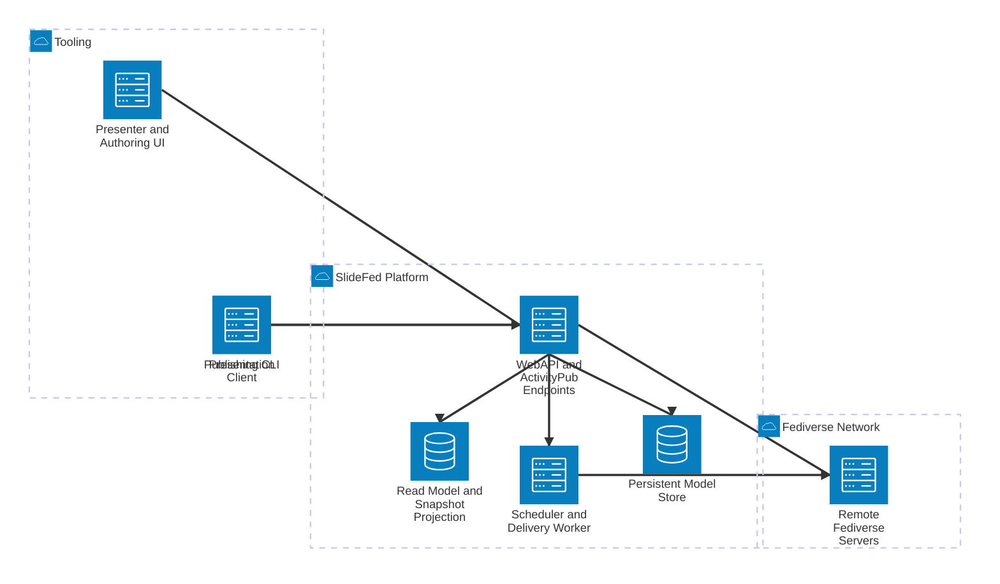

# SlideFed C4 Container View

This view breaks the SlideFed platform into its main deployable and runnable containers.

## Containers

- **Publishing CLI** prepares and publishes decks, slides, and sessions.
- **Presenter and Authoring UI** lets a human author and manage presentation content.
- **Presentation Client** follows a session and renders the active slide as updates arrive.
- **WebAPI and ActivityPub Endpoints** own HTTP publication, federation, and session state.
- **Scheduler and Delivery Worker** handles start-time activation, outbound fanout, and retries.
- **Persistent Model Store** keeps the canonical domain data.
- **Read Model and Snapshot Projection** supports fast session bootstrap and late-join rendering.
- **Remote Fediverse Servers** exchange ActivityPub traffic with SlideFed.

## Main Flows

- The CLI and authoring UI submit publication requests to the WebAPI.
- The WebAPI persists the canonical model and emits work for delivery and projection.
- The worker handles federation delivery and scheduled transitions.
- The presentation client subscribes to a session, receives updates, and renders the current slide.
- The projection store serves late-join snapshots and read-heavy session views.

## Next View

- Component view: split the WebAPI into publication, session lifecycle, follow/bootstrap, and federation components.
