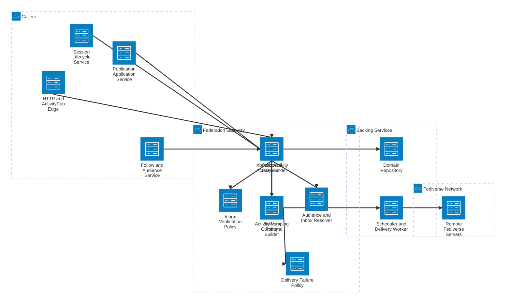

# SlideFed Federation Gateway Detail

This view expands the Federation Gateway and shows how internal SlideFed events are translated into outbound ActivityPub delivery and how inbound federation traffic is normalized.

## Components

- **Inbound Activity Handler** receives remote inbox traffic and normalizes it into internal commands or events.
- **Outbound Activity Builder** translates internal SlideFed events into standard ActivityPub messages.
- **Activity Mapping Policy** keeps SlideFed’s internal vocabulary aligned with AS2 and ActivityPub message shapes.
- **Inbox Verification Policy** validates remote sender identity, signature, and protocol-level trust checks.
- **Audience and Inbox Resolver** determines which remote inboxes should receive each outbound activity.
- **Delivery Command Builder** creates the work items that the worker will execute for fanout.
- **Delivery Failure Policy** governs retry, backoff, and failure recording behavior.

## Main Flows

- Internal publication, session, and follow events are translated into outbound ActivityPub messages.
- The gateway resolves target inboxes and hands delivery commands to the worker.
- Remote inbox traffic is authenticated, mapped into internal semantics, and persisted or forwarded as needed.
- Delivery failures are handled through explicit retry policy rather than being hidden inside controller logic.
