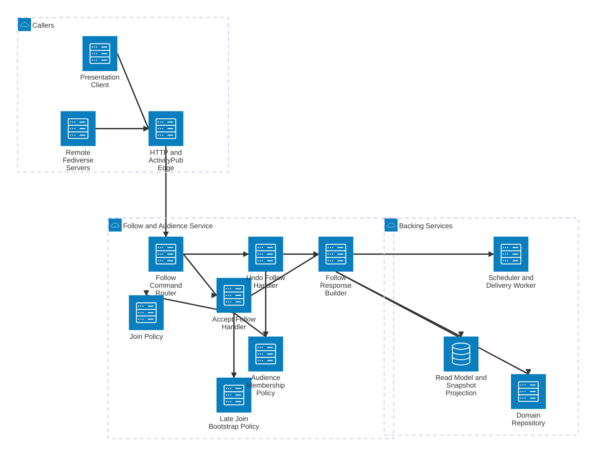

# SlideFed Follow and Audience Service Detail

This view expands the Follow and Audience Service and shows how SlideFed accepts follows, applies join rules, and prepares late-join snapshots for presentation clients.

## Components

- **Follow Command Router** directs inbound `Follow` and `Undo(Follow)` activities to the appropriate handler.
- **Accept Follow Handler** validates and accepts new follows for presenters or sessions.
- **Undo Follow Handler** removes an existing audience relationship.
- **Join Policy** enforces whether following is allowed before start, mid-stream, or after end.
- **Late Join Bootstrap Policy** chooses the MVP snapshot-only bootstrap behavior for new followers.
- **Audience Membership Policy** maintains the session audience collection and associated invariants.
- **Follow Response Builder** persists the relationship change and prepares acceptance, bootstrap, and delivery side effects.

## Main Flows

- A presentation client or remote server submits a `Follow` request through the edge.
- The accept-follow handler evaluates whether the session state permits joining under the join policy.
- If accepted, the service updates audience membership and prepares a snapshot-oriented bootstrap response.
- `Undo(Follow)` removes the relationship and stops future session updates from being delivered.
