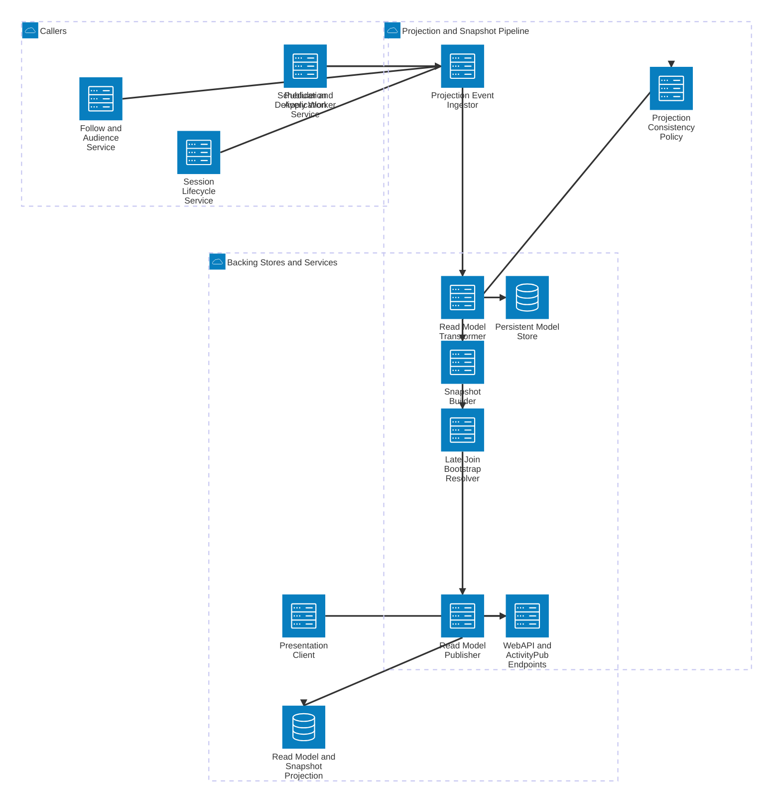

# SlideFed Projection and Snapshot Pipeline Detail

This view expands the read-model path that powers fast client rendering and late-join bootstrap behavior.

## Components

- **Projection Event Ingestor** accepts domain events that should affect read models or snapshots.
- **Read Model Transformer** updates query-optimized session and deck views.
- **Snapshot Builder** produces current-state snapshots for bootstrap and render continuity.
- **Late Join Bootstrap Resolver** applies MVP bootstrap behavior using snapshot-only responses.
- **Projection Consistency Policy** keeps projections coherent with canonical writes despite retries or reordering.
- **Read Model Publisher** exposes projection updates to API-facing read endpoints.

## Main Flows

- Write-side events from publication, lifecycle, follow, and worker processes feed the projection pipeline.
- The transformer and snapshot builder update read models and current session views.
- Late-join bootstrap is served from snapshot artifacts in line with MVP rules.
- The API exposes projection-backed reads that presentation clients consume.
