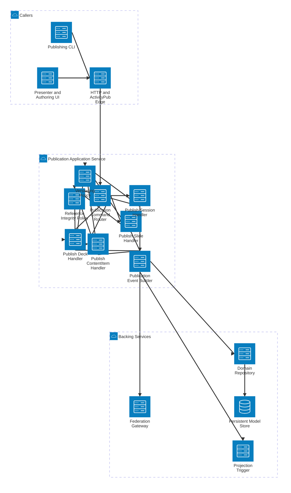

# SlideFed Publication Application Service Detail

This view expands the Publication Application Service and shows how deck, slide, content item, and session publication is validated, persisted, and fanned out.

## Components

- **Publication Command Router** directs create and update publication commands to the correct object-specific handler.
- **Publish ContentItem Handler** publishes first-class content objects that slides reference by URI.
- **Publish Slide Handler** publishes slides that reference only ContentItem URIs.
- **Publish Deck Handler** publishes ordered deck objects that reference only Slide URIs.
- **Publish Session Handler** publishes session objects and initial metadata such as optional `startTime`.
- **Reference Integrity Policy** enforces URI-only references and checks that referenced resources exist.
- **Versioning Policy** applies write-side version semantics to published objects.
- **Publication Event Builder** constructs canonical update events and emits side effects for projection and federation.

## Main Flows

- The CLI or authoring UI sends a publication command through the edge.
- The selected handler validates references and applies versioning policy.
- Canonical changes are persisted via the repository into the persistent store.
- Publication events trigger both read-model projection updates and outbound federation work.
