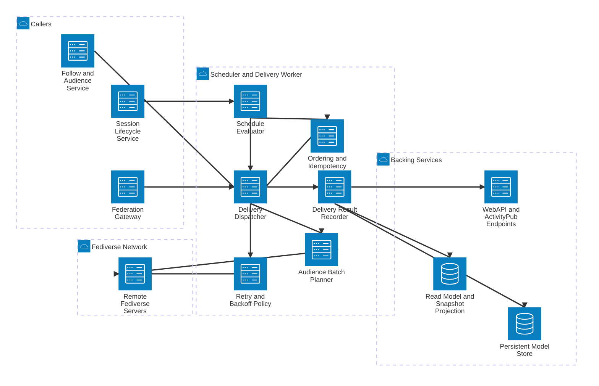

# SlideFed Scheduler and Delivery Worker Detail

This view expands the Scheduler and Delivery Worker container and shows how scheduled session activation, outbound fanout, and delivery retry behavior are executed.

## Components

- **Schedule Evaluator** determines when sessions with `startTime` should move into active delivery windows.
- **Delivery Dispatcher** executes outbound work items generated by session, follow, and federation flows.
- **Audience Batch Planner** partitions audience delivery into practical execution batches.
- **Retry and Backoff Policy** governs transient failure handling and resend cadence.
- **Ordering and Idempotency Policy** ensures repeated or out-of-order commands do not create inconsistent outcomes.
- **Delivery Result Recorder** writes attempt status, failures, and completion records for observability and recovery.

## Main Flows

- Lifecycle and follow-related events produce worker commands.
- The scheduler and dispatcher coordinate what should run now and in what order.
- Deliveries to remote inboxes use retry and ordering policies to preserve correctness.
- Results are persisted and reflected into read-side projections and API-visible status.
