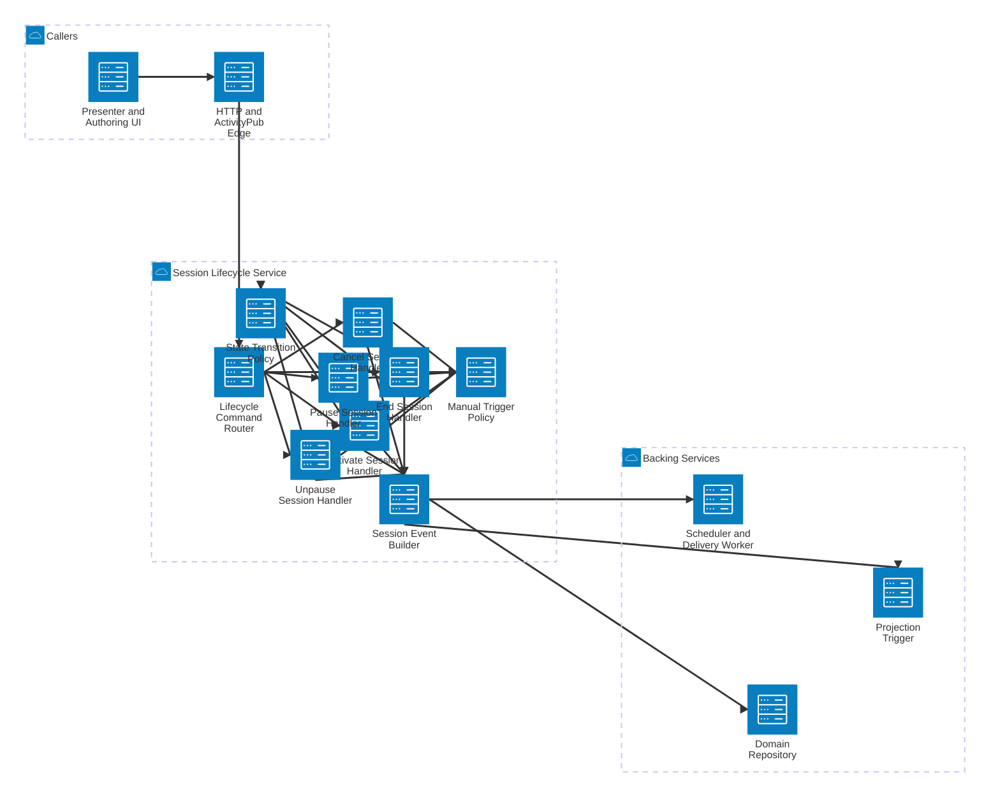

# SlideFed Session Lifecycle Service Detail

This view expands the Session Lifecycle Service and shows the main internal handlers, policies, and infrastructure boundaries that govern manual session state changes.

## Components

- **Lifecycle Command Router** maps incoming lifecycle intents to the correct handler.
- **Activate Session Handler** transitions a `draft` or `canceled` session into `live` when allowed.
- **Pause Session Handler** moves a `live` session into `paused`.
- **Unpause Session Handler** restores a paused session to `live`, potentially modeled as `Undo` of the prior pause activity.
- **Cancel Session Handler** applies the non-terminal MVP `canceled` state.
- **End Session Handler** closes the session with the terminal `ended` state.
- **State Transition Policy** enforces allowed source and target states.
- **Manual Trigger Policy** reflects the MVP rule that transitions are manually triggered rather than time-driven automatically.
- **Session Event Builder** records the canonical session update, emits projection work, and signals downstream delivery.

## Main Flows

- A presenter action enters through the edge and is routed to a lifecycle handler.
- The chosen handler checks whether the requested transition is valid under the state policy.
- The manual trigger policy prevents hidden automatic transitions from bypassing presenter intent in MVP.
- The event builder persists the state change, triggers projection refresh, and signals the worker for delivery.
