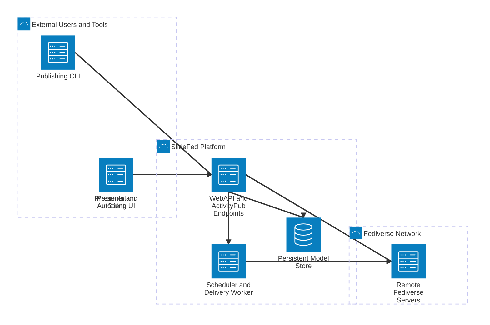

# SlideFed C4 System Context

This is the highest-level C4 view for SlideFed. It shows the people and external systems around the platform, plus the major internal parts that make publication and live presentation work.

## What This View Covers

- Presenters author and publish decks and sessions.
- The CLI prepares and publishes content into the platform.
- Presentation clients follow a session and render the current slide as updates arrive.
- The WebAPI owns publication, federation, and session state.
- The worker handles scheduled activation and outbound delivery.
- The persistent store keeps the canonical model and delivery state.
- Remote Fediverse servers receive and exchange ActivityPub traffic.

## Next Views

- Container view: break SlideFed into API, worker, store, and client-facing edges.
- Component view: split the WebAPI into publication, session, and federation components.
