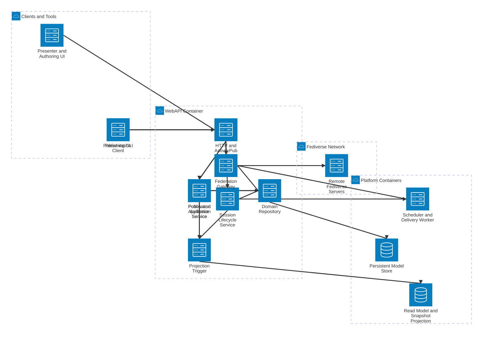

# SlideFed WebAPI Component View

This view zooms into the WebAPI container and shows the main internal components that handle publication, session lifecycle, audience follow behavior, and federation.

## Components

- **HTTP and ActivityPub Edge** terminates HTTP requests, validates ActivityPub envelopes, and routes commands to the right internal service.
- **Publication Application Service** handles deck, slide, and session publication workflows initiated by the CLI or authoring UI.
- **Session Lifecycle Service** applies manual state transitions such as draft, live, paused, canceled, and ended.
- **Follow and Audience Service** handles follow requests, late-join bootstrap decisions, and audience membership rules.
- **Federation Gateway** translates internal actions into outbound ActivityPub delivery and accepts inbound federation messages.
- **Projection Trigger** emits the read-model and snapshot updates needed for fast client rendering and late joins.
- **Domain Repository** loads and persists the canonical domain model against the persistent store.

## Main Flows

- Publication requests enter through the edge and are handled by the publication service, which persists canonical changes through the repository.
- Session control requests enter through the edge and are applied by the session lifecycle service, which also signals scheduling and delivery work.
- Follow requests enter through the edge and are evaluated by the follow service, which decides whether to accept the follow and what snapshot bootstrap to expose.
- Outbound federation is coordinated by the federation gateway, which works with the worker and remote Fediverse servers.
- Read-model refresh and snapshot generation are triggered after publication, state changes, and follow-related events.

## Next View

- Component detail: expand one service, likely the Session Lifecycle Service or Follow and Audience Service, into handlers, policies, and persistence boundaries.
